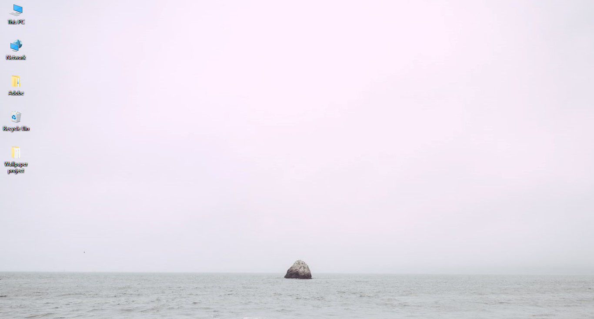

<br/>
<p align="center">
  <a href="https://github.com/kach17/Wallpaper-changer">
    
  </a>

  <h3 align="center">Wallpaper Changer</h3>

  <p align="center">
    A powerful yet simple wallpaper changer made in Python.
    <br/>
    <br/>
    <a href="https://github.com/kach17/Wallpaper-changer/issues">Report Bug</a>
    .
    <a href="https://github.com/kach17/Wallpaper-changer/issues">Request Feature</a>
  </p>
</p>

     

## Table Of Contents

* [About the Project](#about-the-project)
* [Built With](#built-with)
* [Getting Started](#getting-started)
* [Usage](#usage)
* [Roadmap](#roadmap)
* [Contributing](#contributing)
* [License](#license)
* [Authors](#authors)
* [Acknowledgements](#acknowledgements)

## About The Project



###### Another Wallpaper changer on GitHub but this one is quite customizable and powerful.

##### With this you can -

1) Change your wallpaper **automatically after specified time delay**. 
2) Get them **from Unsplash** which is an excellent source of High Quality images, best for being PC wallpapers.
3) Get wallpapers with **your own keywords** !
   
4)  ```Don't wanna use Unsplash?```
 Add your own **local wallpapers** !

5) ``` Too tired to do it manually?```
 Simply provide a url and it'll directly **change wallpaper from the given link!**
6) And **much more** !!


Here's why:

* I rarely used to change wallpapers because it was such a hassle doing it manually from time to time but with this I get to see so much better and high quality wallpapers without ever bothering about it.
* Also not gonna lie, making it was fun.

## Built With

##### ~ Python


## Getting Started

* Run the **main_file** to begin changing wallpapers.
* Go to **settings**  for customization.
* For **Local wallpapers** move your wallpapers to **'Wallpaper Folder'**.

## Usage

I have tried to make it as user friendly as I could.
The **settings** script has functions as follows:
1) Change wallpaper (manually)
2) Save wallpaper in a 'Saved wallpapers' folder
3) Save wallpaper as-
4) Settings:
    * Change keywords
    * Change time delay
    * Provide custom link to get wallpapers from
    * Change the source of wallpapers (i.e. either from unsplash, or locally specified or from custom link)

## Roadmap

See the [open issues](https://github.com/kach17/Wallpaper-changer/issues) for a list of proposed features (and known issues).

## Contributing

Contributions are what make the open source community such an amazing place to be learn, inspire, and create. Any contributions you make are **greatly appreciated**.
* If you have suggestions for adding or removing projects, feel free to [open an issue](https://github.com/kach17/Wallpaper-changer/issues/new) to discuss it, or directly create a pull request after you edit the *README.md* file with necessary changes.
* Please make sure you check your spelling and grammar.
* Create individual PR for each suggestion.
* Please also read through the [Code Of Conduct](https://github.com/kach17/Wallpaper-changer/blob/main/CODE_OF_CONDUCT.md) before posting your first idea as well.

### Creating A Pull Request

* Fork it
* Clone it to your local system
* Make a new branch
* Make your changes
* Push it back to your repo
* Click the Compare & pull request button
* Click Create pull request to open a new pull request

## License

Distributed under the MIT License. See [LICENSE](https://github.com/kach17/Wallpaper-changer/blob/main/LICENSE.md) for more information.

## Authors

* **Karthik Chaoji** - *Comp Sci Student* - [Karthik Chaoji](https://github.com/kach17) - *Original author* .
